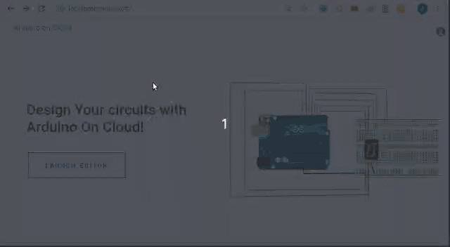
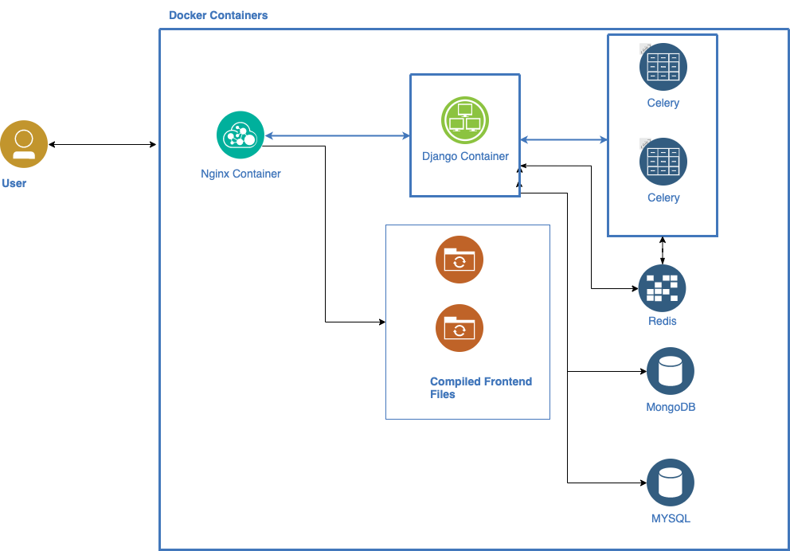

# eSim Cloud and Arduino on Cloud
[](https://www.codefactor.io/repository/github/frg-fossee/esim-cloud)
[](https://esim-cloud.readthedocs.io/en/latest/?badge=latest)
[](https://discord.gg/cZbDD8K)


Development branch status


### Demo (eSim on Cloud)


### Demo (Arduino on Cloud)




### Configuring Production Environment
* Install Docker and docker-compose for server OS
* ``` git clone git@github.com:frg-fossee/eSim-Cloud.git && cd eSim-Cloud```
* ``` cp .env .env.prod ```
 **PLEASE CHANGE DEFAULT CREDENTIALS IN THE .env.prod FILE**
* ``` docker-compose -f docker-compose.prod.yml --env-file .env.prod up --scale django=2 --scale celery=3 -d```
* Please run ``` sh migrations.sh ``` inside the django container after DB and django has finished initializing for applying database migrations, and generating and seeding SVGs
### Configuring Development Environment
[](https://ssh.cloud.google.com/cloudshell/editor?cloudshell_git_repo=https%3A%2F%2Fgithub.com%2Ffrg-fossee%2FeSim-Cloud&cloudshell_git_branch=develop&cloudshell_print=first_run.dev.sh&cloudshell_tutorial=README.md)
#### Setting up docker containers
* Install docker-ce and docker-compose for your OS

* To build and run migrations ( Pulls latest dev image from github)
``` /bin/bash first_run.dev.sh ``` ( for the first time only )

* To Start all containers
``` docker-compose -f docker-compose.dev.yml --env-file .env up ```  do note it might take a while to initialize / throw some errors if they're initialized in the wrong order , running the command again will most likely fix the issue.

------------------------------------------------------------------------------
* To manually build containers
```docker-compose -f docker-compose.dev.yml --env-file .env build```

##### For Setting up Backend containers only

* Run Development environment

 ```docker-compose -f docker-compose.dev.yml --env-file .env up django```

##### For Frontend Containers and backend containers
( Please note these containers are only for dev environment, in production compiled files will be served by nginx)
* To run eda-fronted along with all backend containers

``` docker-compose -f docker-compose.dev.yml --env-file .env up eda-frontend ```

* To run arduino-frontend along with all backend containers

``` docker-compose -f docker-compose.dev.yml --env-file .env up arduino-frontend ```

##### DB Switching Instructions
* To switch between databases, follow the instructions below
* Please note *all data in the database will be lost*
* Turn off existing containers ```docker-compose -f docker-compose.dev.yml down```
* Switch to the needed config inside .env then copy it to prod config ``` cp .env .env.prod ``` , make needed changes ( if required) in the prod config
* Uncomment the appropriate DB Block inside docker-compse.(dev/prod).yml , please note only one db block should be present
* Build Containers and run db migrations again ``` ./first_run.dev.sh ```

##### Ubuntu Installation Dump
* Note: These are all commands being executed to setup the project's development environment on a fresh ubuntu system with username ``` ubuntu ```

```

   git clone https://github.com/frg-fossee/eSim-Cloud/

   cd eSim-Cloud/

   git checkout develop

   sudo curl -L "https://github.com/docker/compose/releases/download/1.25.5/docker-compose-$(uname -s)-$(uname -m)" -o /usr/local/bin/docker-compose

   sudo chmod +x /usr/local/bin/docker-compose

   sudo apt-get remove docker docker-engine docker.io containerd runc

   curl -fsSL https://get.docker.com -o get-docker.sh

   sudo sh get-docker.sh

   sudo usermod -aG docker ubuntu

   sudo systemctl start docker

   sudo systemctl status docker

   sudo docker ps

   sudo ./first_run.dev.sh

```

* If you notice ``` ERROR: UnixHTTPConnectionPool(host='localhost', port=None): Read timed out. ``` or ``` Exited with code 137```, it means docker / host system ran out of memory


* Alternatively docker images can be directly pulled from github instead of building on system
```
   echo $GITHUB_TOKEN | docker login docker.pkg.github.com --username [github_username] --password-stdin
   sudo docker-compose -f docker-compose.dev.yml pull
   sudo docker-compose -f docker-compose.dev.yml up --env-file .env -d db
   ----WAIT FOR DB TO FINISH INITIALIZING-----
   sudo docker-compose -f docker-compose.dev.yml --env-file .env up
```



